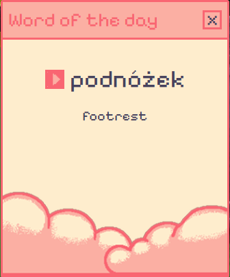

# 🌸 Pixel Word of the Day 🇵🇱

Welcome to **Pixel Word of the Day** — a cute, pink, pixel-style web app that helps you learn Polish one word at a time!

✨ Each day, you'll get:
- A new Polish word 🧠
- Its English translation 🇬🇧
- A built-in text-to-speech audio player 🔊

Whether you're just starting out with Polish or brushing up, this app makes language learning a little more fun and a lot more aesthetic.

## 🧰 Built With

- **HTML/CSS/JavaScript**
- **Electron Framework** – for desktop compatibility
- **Text-to-Speech API** – to help with pronunciation

## 💖 Why I Made This

I'm passionate about languages and love cute visual styles. I wanted to make something simple, useful, and fun — so this project became a way to mix learning with a pixel art vibe that I enjoy creating.

## 📸 Screenshots



## 🚀 Getting Started

If you'd like to run the app locally:

```bash
git clone https://github.com/yourusername/pixel-word-of-the-day.git
cd pixel-word-of-the-day
npm install
npm start
